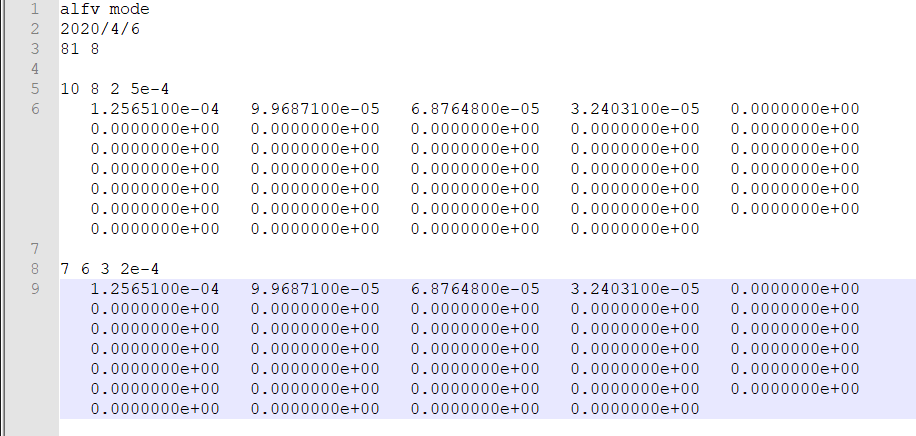

# 数值扰动添加方法

## readptrbx

### 数值扰动函数说明

```fortran
      subroutine readptrbx
      IMPLICIT NONE
      include 'orbcom'
      REAL*8 dpx,dum,dum2,dbsmax,dnmax,omrat,ampdum,alimit
      REAL*8 thetd,zetd,sdum,agg,snmd,xx2,dp2,rdum,qmn
      REAL*8 qfun,qdum,pdum,rpol,giac,dum3
      INTEGER md,ndum,mdum,j,jm,jp,jpp,m,lptm,ldum,mload,k,jd,l,n
      INTEGER jdum,idum,kdum,mmin,mmax,nmd
C============
ccc-modified for file from Nikolai, 3/2012, read xi
      nval = 0
      modes = 0
cc      plabel = "Xin08w.1267E+01"
ccc add file for TAEs of east, 10/2017
      plabel = "file.txt" ! 读取的文件
      open(61,file=plabel,status='unknown')  ! 61是随便给的一个数字, 来标识打开的文档, 下面的read(61,*)就是读取标号为61的文档
      write(6,801) plabel
 801  format('  subroutine readptrbx, perturbation read=   ',A30)
      read(61,*) 
      read(61,*) 
      read(61,*)  ! 前三行, 只读取, 什么都不做
      read(61,*) lpt,nmd,mmin,mmax,dum,ndum ! 第四行的数字赋给一下变量, lpt=201
cc      write(6,*)  lpt,nmd,mmin,mmax,dum,ndum
      lptm = lpt - 1
      dpx = pw/lptm
      read (61,*) jdum,idum ! 第五行
ccc      write(6,*) jdum,idum
      do kdum = 1,2*idum ! 循环, idum控制循环次数, 应该是读取扰动信息
      read(61,*) ! 读取第六行第七行
      enddo
      read (61,*) jdum,idum ! 第八行
      read (61,*) jdum,idum ! 第九行, jdum=201, idum=9, 行数列数
      write(6,*) jdum,idum
ccccccccccccccccccccccccccccc
      read(61,*) ((xi1(j,md),j=1,lpt),md = 1,idum) ! 第十行是真正读的内容, 赋给xi1这个数组, lpt行, idum列. idum列每一列都是一个扰动. 第一行到最后一行对应磁面划分, 行数应当等于格点数. 数值大小对应扰动大小, 最大值为1. 扰动幅度可以由amp控制. 转化成xi1数组的时候, 先转化行, 再转化列, 和matlab函数reshape的工作模式是一致的. 
cccccccccccccccccccccccccccc
      modes = modes + mmax - mmin + 1
      nval = 1
      harm(nval) = mmax - mmin + 1
      do md = 1,harm(nval)
         alfv(md) = 1
         amp(md) = 0.1D-4
cc       omegv(md) = 1.e-4
         omegv(md) = 207*2.0D3*pi/omeg0
cc       omegv(md) = 7.5e-3
         nmod(md) = nmd
         mmod(md) = mmin - 1 + md
         enddo
 81   continue
      nvalx = nval
cccccccccccccccccccccccc
ccccc-  The perturbation harmonics are used only from md1 to md2
      md1 = 1
      md2 = modes
cccccccccccccccccccc  Select one mode
      if(nplot.eq.9.or.nplot.eq.8) then
      nvalx = 1
      nval = 1
      md1 = 1
      md2 = 1
      modes = md2 - md1 + 1
      endif
cccccccccc-renormalize 
      dum =  1.  ! amplitude renormalization
      dum2 = 1.  ! frequency renormalization
      write(6,57) dum,dum2,nval
 57   format('  change amp,freq, nval',1p2e12.4,i6)
            do 50 md = md1,md2
               amp(md) = amp(md)*dum   !   modify mode amplitude
               omegv(md) = omegv(md)*dum2     !  modify frequency
                dum3 = omegv(md)*omeg0/(2.D3*pi)
ccc               write(6,52) md,mmod(md),nmod(md),amp(md),dum3
 52               format(i4,' mode- m,n,amp, freq ',2i4,1p2e12.4)
ccc             write(6,121)(xi1(j,md),j=1,lpt)
 50            continue
               call splnx
               return
               end
```

所以这个函数可以修改为这样

```fortran
      subroutine readptrbx
      IMPLICIT NONE
      include 'orbcom'
      REAL*8 dpx,dum,dum2,dbsmax,dnmax,omrat,ampdum,alimit
      REAL*8 thetd,zetd,sdum,agg,snmd,xx2,dp2,rdum,qmn
      REAL*8 qfun,qdum,pdum,rpol,giac,dum3
      INTEGER md,ndum,mdum,j,jm,jp,jpp,m,lptm,ldum,mload,k,jd,l,n
      INTEGER jdum,idum,kdum,mmin,mmax,nmd,mmd
C============
      plabel = "Xin08w.1267E+01"
      open(61,file=plabel,status='unknown') 
      write(6,801) plabel
 801  format('  subroutine readptrbx, perturbation read=   ',A30)
      read(61,*) jdum,idum
      lpt = jdum
      lptm = lpt - 1
      dpx = pw/lptm
      write(6,*) jdum,idum
      read(61,*) ((xi1(j,md),j=1,lpt),md = 1,idum)
cccccccccccccccccccccccccccc
      modes = idum
      nval = 1
      harm(nval) = mmax - mmin + 1
      
c         alfv(md) = 1
c         amp(md) = 1.D-4
c         omegv(md) = 207*2.0D3*pi/omeg0
c         nmod(md) = nmd
c         mmod(md) = mmd
 81   continue
      nvalx = nval
cccccccccccccccccccccccc
ccccc-  The perturbation harmonics are used only from md1 to md2
      md1 = 1
      md2 = modes
cccccccccccccccccccc  Select one mode
      if(nplot.eq.9.or.nplot.eq.8) then
      nvalx = 1
      nval = 1
      md1 = 1
      md2 = 1
      modes = md2 - md1 + 1
      endif
cccccccccc-renormalize 
      dum =  1.  ! amplitude renormalization
      dum2 = 1.  ! frequency renormalization
      write(6,57) dum,dum2,nval
 57   format('  change amp,freq, nval',1p2e12.4,i6)
            do 50 md = md1,md2
                dum3 = omegv(md)*omeg0/(2.D3*pi)
 52               format(i4,' mode- m,n,amp, freq ',2i4,1p2e12.4)
 50            continue
               call splnx
               return
               end
```

### 扰动文件

扰动文件的格式为

```
 81   8 ; 第一行为: 行数, 列数
   0.000 ; 第二行: 整个扰动数据都要放在第三行. 所以第三行的数字个数为 行数x列数
```

扰动数据的生成方法: 

* 假设数组a是扰动数据, 则a的每一列对应一个扰动, 一列的每一行对应一个扰动的大小
* 然后将a展开 `b = a(:)'`;
* 把b存进文件 `save('perturb.dat','b','-ascii')`
* 把文件里面的数据粘贴到扰动文件下

最终的文件应该只有两行, 像这样: 


不要有很多行. 


### 修改orbit文件并提交任务

* 在perturb.f中指定扰动文件文件名
* 在orbit.F中设置`npert=4`并写下`call readptrbx`

## readptrba

### 数值扰动函数说明

```fortran
      subroutine readptrba
      IMPLICIT NONE
      include 'orbcom'
      REAL*8 dpx,dum,dum2,dbsmax,dnmax,omrat,ampdum,alimit
      REAL*8 thetd,zetd,sdum,agg,snmd,xx2,dp2,rdum,qmn
      REAL*8 qfun,qdum,pdum,rpol,giac
      INTEGER md,ndum,mdum,j,jm,jp,jpp,m,lptm,ldum,mload,k,jd,l,n
C============
ccc-modified for file from Nikolai, read alpha
      plabel = "ptr1_sm_141711.dat"
      open(61,file=plabel,status='unknown') 
      write(6,801) plabel
 801  format('  subroutine readptrba, perturbation read=   ',A30)
      nval = 0
      read(61,*) 
      read(61,*) 
      read(61,*) lpt,mload ! 行数和列数, 列数也是扰动文件中数值的行数
      lptm = lpt - 1
      dpx = pw/lptm
      nval = nval+1
      do  md=1,mload
         alfv(md) = nval
         read(61,*)  !　空行
         read(61,*) mmod(md),nmod(md),omrat,amp(md)
         omegv(md) = 13.69*omrat*2.0D3*pi/omeg0 
         read(61,111) (a1(j,md),j=1,lpt) ! 一行数据保存为数组中的一列
      enddo ! 说明如果有n个扰动, 就要写n行
      modes = modes + mload
      harm(nval) = mload
      open(62,file='ptr2_sm_141711.dat',status='unknown') ! 读取多个扰动文件, 可以删除. 如需要读取, 复制粘贴这一段即可
      read(62,*) 
      read(62,*) 
      read(62,*) lpt,mload
      lptm = lpt - 1
      dpx = pw/lptm
      nval = nval+1
      do  md = modes + 1,modes + mload
         alfv(md) = nval
      read(62,*) 
      read(62,*) mmod(md),nmod(md),omrat,amp(md)
      omegv(md) = 13.69*omrat*6280/omeg0 
      read(62,111) (a1(j,md),j=1,lpt)
      enddo
      modes = modes + mload
      harm(nval) = mload
  111 format(8e12.5)
      open(63,file='ptr3_sm_141711.dat',status='unknown')
      read(63,*) 
      read(63,*) 
      read(63,*) lpt,mload
      lptm = lpt - 1
      dpx = pw/lptm
      nval = nval+1
      do  md = modes + 1,modes + mload
         alfv(md) = nval
      read(63,*) 
      read(63,*) mmod(md),nmod(md),omrat,amp(md)
      omegv(md) = 13.69*omrat*6280/omeg0 
      read(63,111) (a1(j,md),j=1,lpt)
      enddo
      modes = modes + mload
      harm(nval) = mload
      open(64,file='ptr4_sm_141711.dat',status='unknown')
      read(64,*) 
      read(64,*) 
      read(64,*) lpt,mload
      lptm = lpt - 1
      dpx = pw/lptm
      nval = nval+1
      do  md = modes + 1,modes + mload
         alfv(md) = nval
      read(64,*) 
      read(64,*) mmod(md),nmod(md),omrat,amp(md)
      omegv(md) = 13.69*omrat*6280/omeg0 
      read(64,111) (a1(j,md),j=1,lpt)
      enddo
      modes = modes + mload
      harm(nval) = mload
      nvalx = nval
cccccccccccccccccccccccc
ccccc-  The perturbation harmonics are used only from md1 to md2
      md1 = 1
      md2 = modes
cccccccccccccccccccc  Select one mode
      if(nplot.eq.9.or.nplot.eq.8) then
      nvalx = 1
      nval = 1
      md1 = 1
      md2 = 14
      modes = md2 - md1 + 1
      endif
cccccccccc-renormalize 
      dum =  1.   ! mode renormalization
      dum2 = 1.
      write(6,57) dum,dum2,nval
 57   format('  change amp,freq, nval',1p3e12.4,i6)
            do 50 md = md1,md2
               amp(md) = amp(k)*dum   !   modify mode amplitude
               omegv(md) = omegv(k)*dum2          !  modify frequency
ccc               write(6,52) md,nmod(md),mmod(md),amp(md)
 52               format(' mode- n,m,amp ',3i4,1pe12.4)
 50            continue
ccccccccccccccc- now spline
               call splna
      return
      end
```

因此, 程序修改为

```fortran
      subroutine readptrba
      IMPLICIT NONE
      include 'orbcom'
      REAL*8 dpx,dum,dum2,dbsmax,dnmax,omrat,ampdum,alimit
      REAL*8 thetd,zetd,sdum,agg,snmd,xx2,dp2,rdum,qmn
      REAL*8 qfun,qdum,pdum,rpol,giac
      INTEGER md,ndum,mdum,j,jm,jp,jpp,m,lptm,ldum,mload,k,jd,l,n
C============
ccc-modified for file from Nikolai, read alpha
      nval = 0
      plabel = "ptr1_sm_141711.dat"
      open(61,file=plabel,status='unknown') 
      write(6,801) plabel
      read(61,*) 
      read(61,*) 
      read(61,*) lpt,mload 
      lptm = lpt - 1
      dpx = pw/lptm
      nval = nval+1
      do  md=1,mload
         alfv(md) = nval
         read(61,*) 
         read(61,*) mmod(md),nmod(md),omrat,amp(md)
         omegv(md) = 13.69*omrat*2.0D3*pi/omeg0 
         read(61,*) (a1(j,md),j=1,lpt)
      enddo
      modes = modes + mload
      harm(nval) = mload
 111  format(8e12.5)
 801  format('  subroutine readptrba, perturbation read=   ',A30)
      nvalx = nval
cccccccccccccccccccccccc
ccccc-  The perturbation harmonics are used only from md1 to md2
      md1 = 1
      md2 = modes
cccccccccccccccccccc  Select one mode
      if(nplot.eq.9.or.nplot.eq.8) then
      nvalx = 1
      nval = 1
      md1 = 1
      md2 = 14
      modes = md2 - md1 + 1
      endif
cccccccccc-renormalize 
      dum =  1.   ! mode renormalization
      dum2 = 1.
      write(6,57) dum,dum2,nval
 57   format('  change amp,freq, nval',1p3e12.4,i6)
            do 50 md = md1,md2
               amp(md) = amp(k)*dum   !   modify mode amplitude
               omegv(md) = omegv(k)*dum2          !  modify frequency
 52               format(' mode- n,m,amp ',3i4,1pe12.4)
 50            continue
ccccccccccccccc- now spline
               call splna
      return
      end
```


### 扰动文件

```
; 第一行, 随便写, 可以写一些关于文件的说明信息
; 第二行, 随便写
lpt mload; 第三行, 格点数 模数, 比如说81个格点, 8个模, 接下来开始进入模的读取循环, 一共循环mload次
; 第四行, 空行
m n omrat amp; 第五行, m值, n值, omrat是频率, 单位是kHz, amp是幅度
; 第六行, 把这一支模的信息写在这一行里, 一共有lpt个数据
; 仿照第四行到第六行写入数据
```

最后的文件应该像这样

